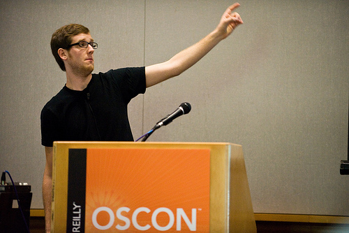

!SLIDE

# NoSQL #
# The Definitive Guide #

Berlin Buzzwords 2010

!SLIDE bullets incremental

# `whoami` #

* [Mathias Meyer](http://www.paperplanes.de)
* Chief Visionary at [Peritor](http://www.peritor.com)
* Clouds, Ruby, NoSQL
* [@roidrage](http://twitter.com/roidrage)
* [github.com/mattmatt](http://github.com/mattmatt)

!SLIDE center

## Awesome Cloud Management and Deployment ##
## [@scalarium](http://twitter.com/scalarium)

!SLIDE

# Disclaimer #

!SLIDE

# I'm just a regular user #
## I just love to play and work with shiny tools. ##

!SLIDE

## I blame these people for me being here. ##

!SLIDE center

# Jan Lehnardt #
  

### CouchDB ###

!SLIDE center

# Salvatore Sanfilippo #
  

### Redis ###

!SLIDE

# NoSQL? #

!SLIDE

# What the heck is it? #

!SLIDE

# Is it about having no SQL? #

!SLIDE

# No. #

!SLIDE

# \#LESSQL #

!SLIDE

# Getting closer. #

!SLIDE

# Post-relational. #

!SLIDE

# Meh. #

!SLIDE

## The technologies aren't new. ##

!SLIDE

## They just come in a prettier package. ##

!SLIDE center

# Scalability? #

!SLIDE

## Somewhat, yes. ##

!SLIDE

# Simplicity? #

!SLIDE

# There you go. #

!SLIDE

## Complexity usually imposes contraints. ##

!SLIDE

## Simplicity aims to remove constraints. ##

!SLIDE

## Simplicity aims to not reinvent the wheel. ##

!SLIDE

# Data! #

!SLIDE

# Yes! #

!SLIDE

## But why data? ##

!SLIDE

## Different use cases require different types of data structures. ##

!SLIDE

## RDBMS knew just one: Tables. ##

!SLIDE

## NoSQL is about using what's right for your data. ##

!SLIDE bullets incremental

# To sum up. #

* Simplicity
* Data
* Scale

!SLIDE

## Note: Order is not random, it's opinionated. ##

!SLIDE

## NoSQL is about evolution, not replacement. ##
