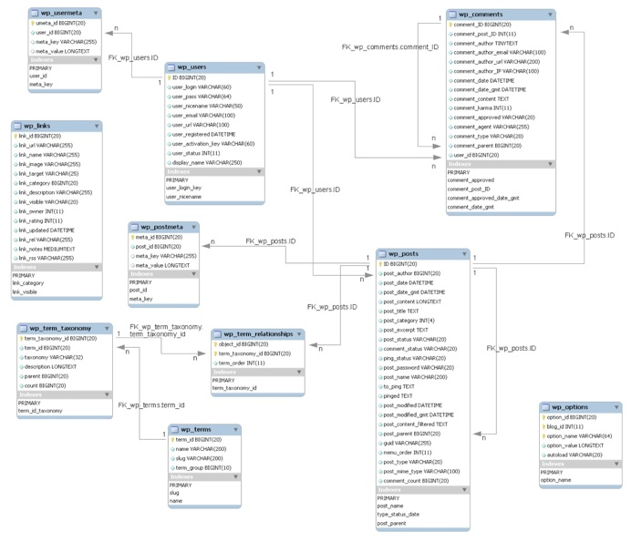
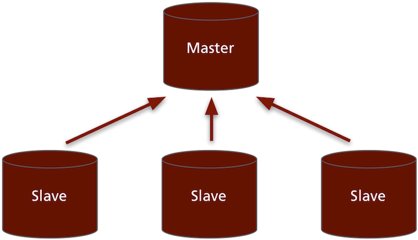
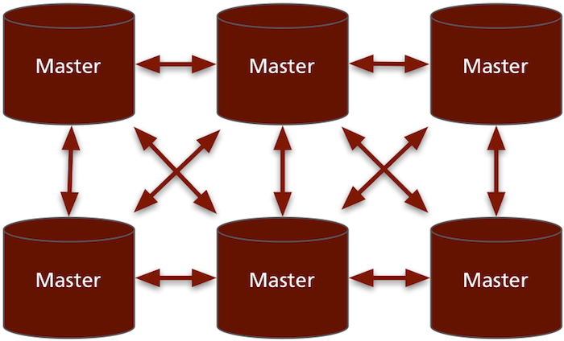
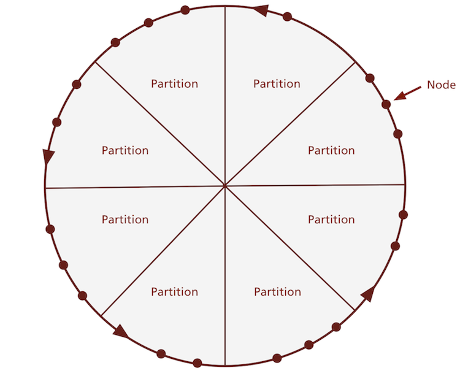
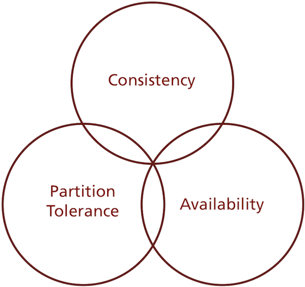

!SLIDE

# Ancient History #

!SLIDE bullets incremental

## We've seen some of this before. ##

* Sort of

!SLIDE

## Relational databases tried to fit all sizes. ##

!SLIDE

> Database research has produced a number of good results, but the relational database is not one of them.

<a href="http://home.pipeline.com/~hbaker1/letters/CACM-RelationalDatabases.html">Henry G. Baker</a>

!SLIDE

## What The Web™ really needs: ##

!SLIDE center

# More structure? #

!SLIDE center

<h1 style="text-decoration: line-through"><strike style="position:relative;top:1px">More structure?</strike></h1>

# No! #

!SLIDE bullets incremental

# Less structure #

* Documents
* Schemaless, not constrained
* JSON

!SLIDE

# Less structure #

    {
      "_id": "45cae57dc7504ebd630a549275",
      "_rev": "2-1403823b3baf6e493a48e7b65",
      "created_at": "2010/05/12 10:09:53",
      "title": "JSON FTW!",
      "author": "Jan"
    }

## Document ##

!SLIDE

# Less structure #

    {
      "_id": "45cae57dc7504ebd630a549275",
      "_rev": "2-1403823b3baf6e493a48e7b65",
      "created_at": "2010/05/12 10:09:53",
      "title": "JSON FTW!",
      "author": "Jan"
    }

## Schemaless ##

!SLIDE

# Less structure #

    {
      "_id": "45cae57dc7504ebd630a549275",
      "_rev": "2-1403823b3baf6e493a48e7b65",
      "created_at": "2010/05/12 10:09:53",
      "title": "JSON FTW!",
      "author": "Jan"
    }

## JSON ##

!SLIDE center

# Simpler Data Access #

    "key" => "value"

!SLIDE

## Simpler access makes one thing easier: ##

!SLIDE center

# Scaling up #

!SLIDE bullets incremental

# How we used to scale up #

* Or at least we tried to

!SLIDE center

## Master-Slave ##

### (Old-school!) ###

!SLIDE center

## P2P ##

### Much better! ###

!SLIDE

# Amazon's Dynamo #

!SLIDE center

## The Ring ##

!SLIDE bullets incremental

* Data is partitioned into slices
* Replicated across N nodes
* Writes go to at least W replicas
* Reads are successful from R replicas

!SLIDE center

## CAP ##

### Pick two! ###

!SLIDE center
 
## Eventual Consistency ##

!SLIDE

# Eventual Consistency #

> The storage system guarantees that if no new updates are made to the object, eventually all accesses will return the last updated value.

<a href="http://www.allthingsdistributed.com/2008/12/eventually_consistent.html">Werner Vogels</a>

!SLIDE

## But where's the history in that? ##
