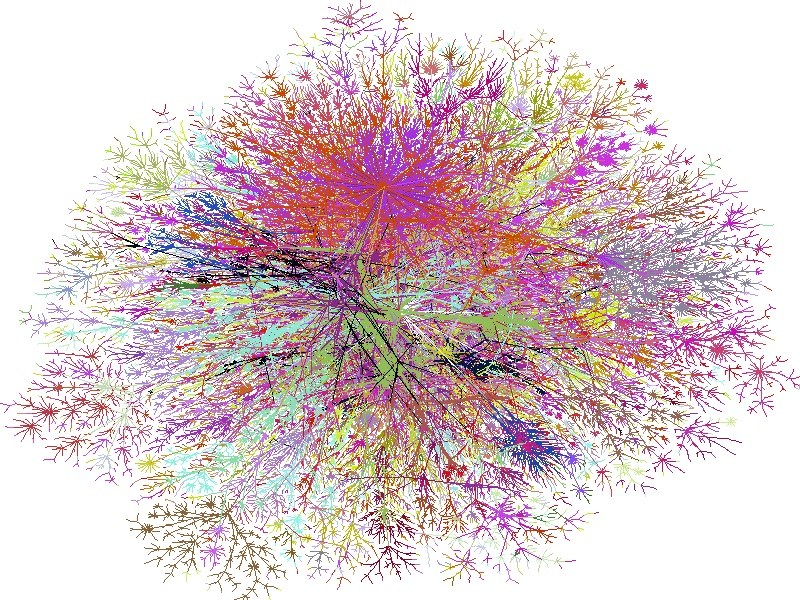

!SLIDE

# Classification #

!SLIDE

## One NoSQL isn't like the other ##

!SLIDE bullets incremental

# The Contestants #

* Key-Value Stores
* Document Databases
* Column Stores
* Graph Databases

!SLIDE bullets incremental

# Key-Value Stores #

* Lookup of data by key
* That's it
* No querying of data

!SLIDE bullets incremental

# BerkeleyDB #

* Built in 1991
* Embedded database engine
* Data stored as serialized array
* Can handle up to 256 TB
* Still actively used

!SLIDE bullets

 
# Key-Value Today #

* Project Voldemort
* Tokyo/Kyoto Cabinet
* Redis
* Amazon S3
* Scalaris

!SLIDE bullets incremental

# Document Databases #

* Rich, self-contained documents (JSON-ish)
* Related data is stored in a document
* Queries with JavaScript and Map/Reduce

!SLIDE javascript

# Document Databases #

    @@@ javascript
    {
      "_id": "45cae57dc7504ebd630a549275",
      "_rev": "2-1403823b3baf6e493a48e7b65",
      "created_at": "2010/05/12 10:09:53",
      "title": "JSON FTW!",
      "author": "Jan"
    }

!SLIDE bullets incremental

# Lotus Notes #

* Built in 1989
* Document-oriented
* Offline-Replication (Multi-Master)
* Unfortunately still in use

!SLIDE bullets

# Today #

* CouchDB
* Riak
* MongoDB
* XML Databases (gasp)

!SLIDE bullets

# CouchDB #

* What Lotus Notes should have been like
* JavaScript, HTTP
* Offline by default
* P2P-like Replication

!SLIDE bullets

# Riak #

* JSON, JavaScript, HTTP
* Dynamo's Ring Model

!SLIDE bullets incremental

# Column Databases #

* Similar data is stored together
* Lookup by key and attribute (fast!)
* Can compress similar data

!SLIDE

## A traditional column in a RDBMS ##

    | name             | when              |
    | Berlin Buzzwords | 7th/8th June 2010 |

!SLIDE javascript

## A column in a Column store ##

    @@@ javascript
    berlinbuzzwords: {
      "name": "Berlin Buzzwords",
      "when": "7th/8th June 2010"
    }

!SLIDE javascript center

## Lookup of values directly by key and attribute ##

    @@@ javascript
    conferences['berlinbuzzwords']['name']

!SLIDE bullets

# Sybase IQ #

* Built in 1996
* Handles data of > 1 PB

!SLIDE bullets

# Today #

* Google's BigTable
* Cassandra
* HBase
* Hypertable

!SLIDE bullets incremental

# Cassandra #

* BigTable and Dynamo
* Sitting in a tree

!SLIDE bullets incremental

# Graph Databases #

* Networks or deep trees of data
* Easy and cheap traversal of relationships

!SLIDE center

# Graph Databases #

!SLIDE bullets incremental

# Versant Object Database #

* Predecessar to graph databases
* Built in 1988
* Transparent persistency for objects
* Could easily store and traverse millions of objects

!SLIDE bullets incremental

# Today #

* Core Data
* Neo4J
* HyperGraphDB

!SLIDE bullets incremental

# Neo4j #

* Embedded engine
* Semi-structured data
* Stores 100 of millions of objects

!SLIDE

## The categories can overlap in some cases. ##

!SLIDE

## A document database can be a key-value store ##

!SLIDE

## A column store is similar to a key-value store ##

!SLIDE

## A graph database is a document database on steroids ##

!SLIDE

## Some document databases can handle graphs as well ##

