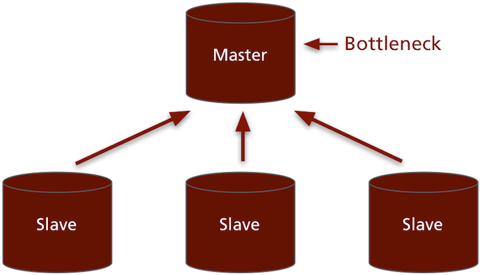
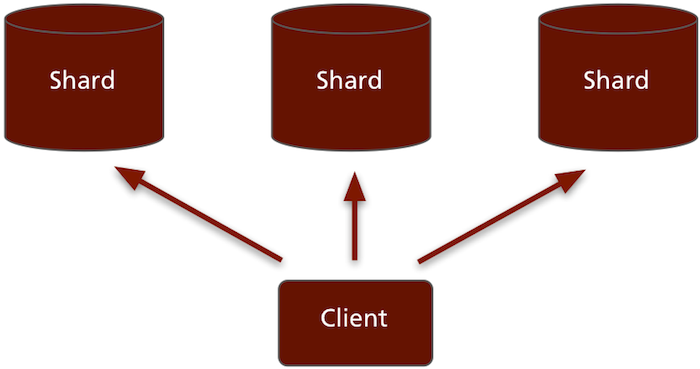
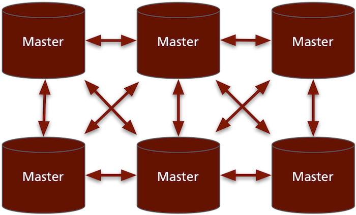
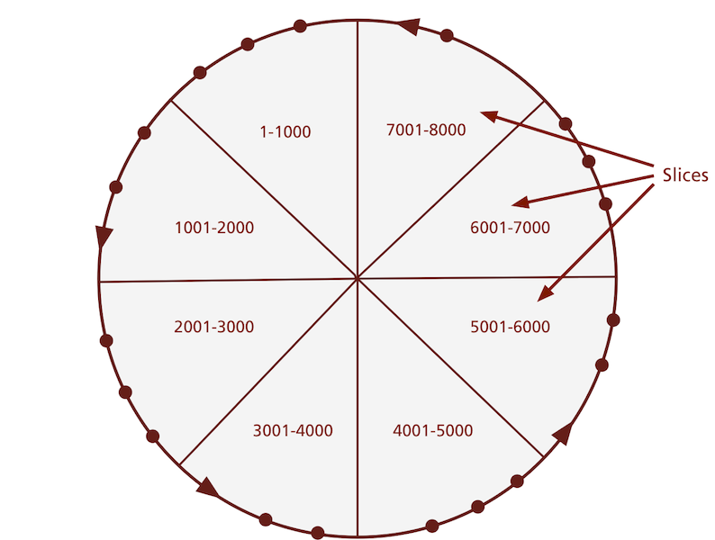
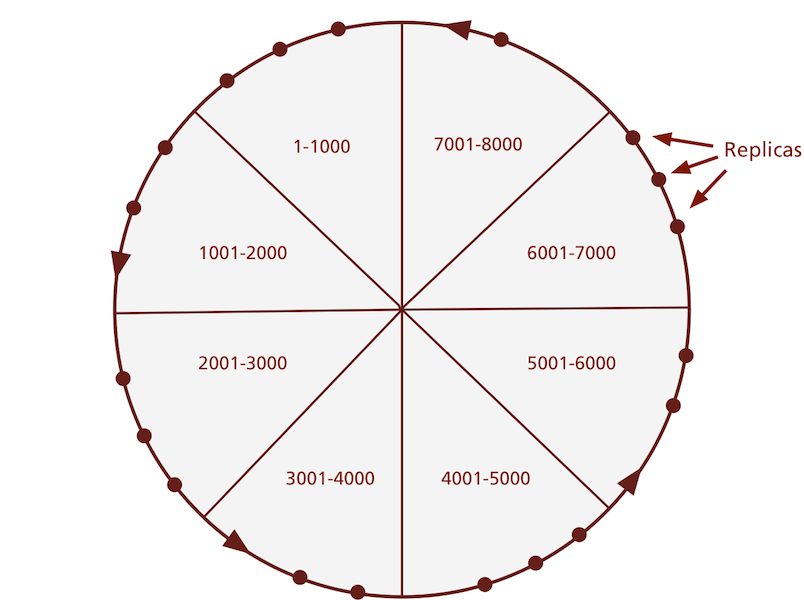
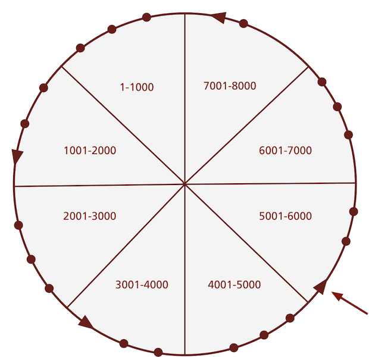

!SLIDE

# Scaling out #

!SLIDE bullets incremental

## An RDBMS model of scaling up: ##

!SLIDE center

## Master-Slave ##

!SLIDE center

## Sharding ##

!SLIDE

## Approaches in NoSQL ##

!SLIDE center

## P2P ##

!SLIDE center

## The CouchDB replication model: ##
## Everyone talks to everyone ##

!SLIDE

# Amazon's Dynamo #

!SLIDE center

## The Ring ##

!SLIDE center

## Data partitioned into slices ##

!SLIDE center

## Replicated across N nodes ##

!SLIDE center

## Every node knows every key ##

!SLIDE bullets incremental

## Ensuring data consistency ##

* Writes go to at least W replicas
* Reads are successful from R replicas
* N, R, W represent the quorum

!SLIDE

# Quorum #

> The minimum number of votes given by replica nodes in a distributed system required to successfully complete a read or write operation.

!SLIDE center
 
## Eventual Consistency ##

!SLIDE

# Eventual Consistency #

> The storage system guarantees that if no new updates are made to the object, eventually all accesses will return the last updated value.

<a href="http://www.allthingsdistributed.com/2008/12/eventually_consistent.html">Werner Vogels</a>

!SLIDE

# Why Dynamo? #

!SLIDE

## Column, key-value and document stores ##

!SLIDE

## ...access data by key ##

!SLIDE

## Key-value access = Partition-friendly ##
