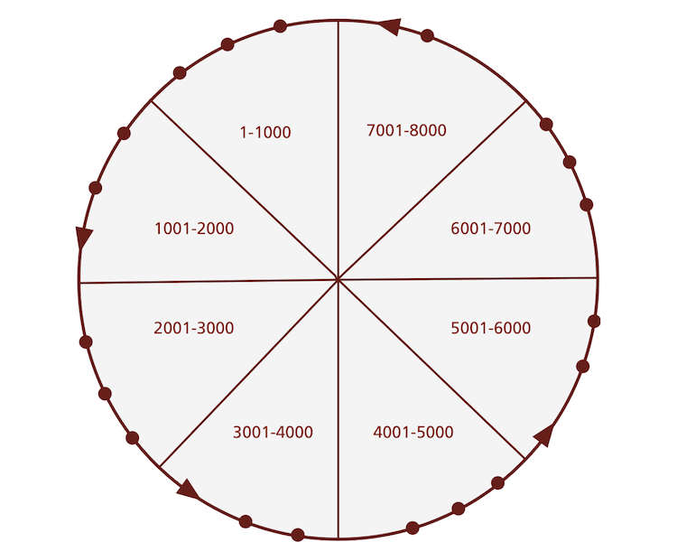

!SLIDE

# Scaling out #

!SLIDE bullets incremental

# How we used to scale up #

* Or at least we tried to

!SLIDE center

## Master-Slave ##

### (Old-school!) ###

!SLIDE

## How we should scale up instead: ##

!SLIDE center

## P2P ##

!SLIDE center

## The CouchDB Replication model ##
## Everyone talks to everyone ##

!SLIDE

# Amazon's Dynamo #

!SLIDE center

## The Ring ##

!SLIDE center

## Every node in the ring knows where any key is in the cluster. ##

!SLIDE bullets incremental

* Data is partitioned into slices
* Replicated across N nodes
* Writes go to at least W replicas
* Reads are successful from R replicas
* N, R, W represent the quorum

!SLIDE

# Quorum #

## The minimum number of votes given by replica nodes in a distributed system required to successfully complete a read or write operation. ##

!SLIDE center

## CAP ##

### Pick two! ###

!SLIDE center

## CAP ##

### The choice of the NoSQL generation. ##

!SLIDE center
 
## Eventual Consistency ##

!SLIDE

# Eventual Consistency #

> The storage system guarantees that if no new updates are made to the object, eventually all accesses will return the last updated value.

<a href="http://www.allthingsdistributed.com/2008/12/eventually_consistent.html">Werner Vogels</a>

!SLIDE

# Why Dynamo? #

!SLIDE

## Key-value access is the simplest thing possible. ##

!SLIDE

## Simpler things are easier to scale up. ##

!SLIDE

## It doesn't matter where the key is ##

!SLIDE

## Only the ring needs to know ##

!SLIDE

## As long as you just need a key to access data ##

!SLIDE

## Scaling out is easy ##

!SLIDE

## ...in theory. ##

!SLIDE

## Column, key-value and document stores ##

!SLIDE

## All access data by key ##

!SLIDE

## They're partitioning-friendly ##

!SLIDE

## Therefore well-suited for hashing ##

