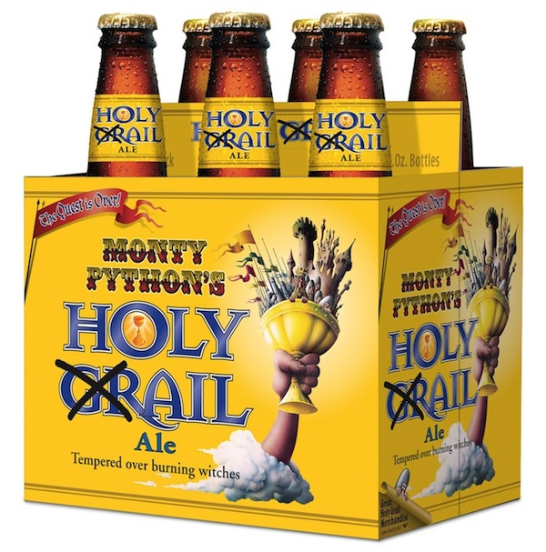

!SLIDE

## How is today different from back then? ##

!SLIDE bullets incremental

* Simplicity isn't new.
* Data is what's important.
* Simpler ways to scale out.

!SLIDE

## Evolution around data and access patterns. ##

!SLIDE

## Open web technologies are a good fit. ##

!SLIDE

## Closed product? ##

!SLIDE

# Run! #

!SLIDE center

## NoSQL is not the holy grail. ##

!SLIDE

## Range queries can be hard. ##

!SLIDE bullets incremental

## Complex ad-hoc queries almost impossible. ##

* Don't scale well across N nodes.

!SLIDE bullets incremental

## No transactions. ##

* Don't scale well in a distributed system.

!SLIDE

## How do I pick the right tool? ##

!SLIDE

# It Depends™ #

!SLIDE

# Data structure. #

!SLIDE bullets incremental

## Simple data, easy to scale out: ##

* Key-value stores
* Column stores

!SLIDE bullets incremental

## Simple data, trimmed for fast access: ##

* Redis
* MongoDB
* Key-value stores

!SLIDE bullets incremental

## Richer data models: ##

* Document databases
* Graph databases

!SLIDE

# Read vs. write patterns. #

!SLIDE bullets incremental

## Always access documents by key: ##

* Key-value stores
* Document databases

!SLIDE bullets incremental

## Access objects by more complex queries: ##

* Document databases
* Graph databases
* Redis (reverse lookups)

!SLIDE bullets incremental

## Only access similar data, even in ranges: ##

* Column stores

!SLIDE bullets incremental

## Ad-hoc queries: ##

* MongoDB
* Neo4j

!SLIDE bullets incremental

## Tightly connected object graphs: ##

* Graph databases
* Object databases
* Riak

!SLIDE bullets incremental

## Easy to scale out: ##

* Riak
* Cassandra
* Project Voldemort
* etc.

!SLIDE

## How do I know I'm not wasting my time? ##

!SLIDE

## Solutions to real-life problems. ##

!SLIDE

## A natural evolution. ##

!SLIDE

## Polyglot data storage. ##

!SLIDE

## The name NoSQL is unfortunate though. ##

!SLIDE

